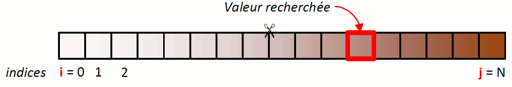
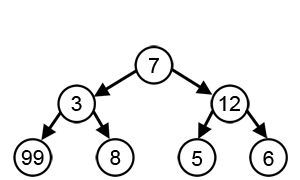

# **TP - Programmation dynamique**

 

## **I) Objectif du TP**

 

L'objectif de ce tp est de réaliser 3 exercices puis de les tester. 
Le premier exercice est une recherche par dichotomie. 
Le second exercice est de réaliser un algorithme glouton. 
Le dernier exercice est le problème du plus grand carré libre.
 
 
 

## *Recherche par dichotomie*

 

La recherche par dichotomie est un algorithme de recherche pour trouver la position d'un élément dans un tableau trié.  
Le principe est simple, on compare l'élément avec la valeur de la case au milieu du tableau, si les valeurs sont égales, la tâche est accomplie, sinon on recommence dans la moitié du tableau la plus pertinente, c'est-à-dire la partie supérieure ou supérieure par rapport à la case du milieu testée.
 
 

 
 
 

## *Algorithme glouton*

 

Un algorithme glouton est un algorithme qui suit le principe de faire, étape par étape, un choix optimum local, dans l'espoir d'obtenir un résultat optimum global.  
Par exemple, dans le problème de rendu de monnaie, l'algorithme qui consiste à répéter le choix de la pièce de plus grande valeur qui ne dépasse pas la somme restante est un algorithme glouton.  
Dans les cas où l'algorithme ne fournit pas systématiquement la solution optimale, il est appelé une heuristique gloutonne.
 
 
 
 
 
 

## *Problème du plus grand carré libre*

 

Le probème du plus grand carré libre consiste à trouver parmis une matrice générée aléatoirement, le plus grand carré blanc disponible parmis tous les points ayant été générés.
 
 
 
 
 
 

## **II) Les différentes commandes**

 

## *Éxécution du programme*

 

Afin d'éxécuter le programme, vous devez simplement lancer le programme via la touche `F5` de votre clavier ou avec le terminal en lancant le fichier `main.c`. 

 
 
 

## *Génération de la documentation*

 

Pour générer la documentation du projet, il vous suffit d'exécutez la commande `make documentation` dans le terminal du projet. 
Cette commande permettra de mettre à jour la documentation et de lancer directement la page internet de la documentation.

 
 
 

## **III) Résultats attendus**

 

- Le projet doit contenir les 4 exercices demandés
- Les fonctions doivent correspondrent aux différents besoins du TP
 
 
 

## **IV) Évolution à venir**

 

- Ajouter l'exercice 3
- Effectuer des tests unitaires
 
 
 

## **V) Auteur**

 

- **JANVIER Pierre** _alias_ [@p.janvier](https://gitlab.com/p.janvier) | [@p-janvier](https://github.com/p-janvier)